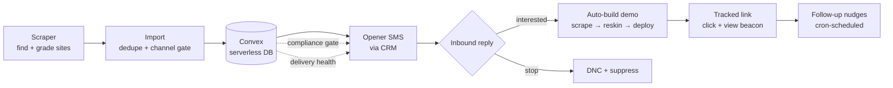

# Cold-Outreach Automation

An end-to-end, compliance-first lead-generation platform for local home-services businesses. It **finds** businesses running outdated websites, **reaches out** over SMS within legal guardrails, **auto-builds** a modern demo site the moment a prospect shows interest, and **tracks** the funnel end to end — all on a serverless, event-driven backend.

> Built as a full-stack systems project: data pipeline + serverless backend + third-party API orchestration + an automated site-generation engine, with regulatory compliance (TCPA / 10DLC) enforced in code.

---

## What it does



1. **Discover** — a Google Places scraper finds local trade businesses, scores each site's "outdatedness" with heuristics plus a vision model, and emits ranked leads.
2. **Qualify & load** — leads are deduped and imported into a serverless datastore behind a per-state channel gate (who may legally be texted).
3. **Reach out** — a cold opener goes out over SMS through a CRM's messaging API, drawn from a rotating sender-number pool, gated by kill-switch, DNC, quiet-hours, and state rules.
4. **Convert on interest** — an inbound "yes" triggers an automated build: the prospect's old site is scraped, images are AI-gated, a premium template is re-skinned with their real details, deployed to Vercel, and returned as a **tracked** link.
5. **Follow up** — click/view tracking and a cron-driven nudge sequence run the rest of the funnel, halting the instant a prospect replies or opts out.

---

## Engineering highlights

- **Serverless, reactive backend** ([`convex/`](convex/)) — the entire state machine, scheduling, HTTP webhooks, and cron jobs run as typed serverless functions with a reactive database. No servers to manage.
- **Compliance-as-code** ([`convex/lib.ts`](convex/lib.ts), [`convex/dnc.ts`](convex/dnc.ts)) — TCPA / 10DLC rules are enforced at **every** send path, not bolted on:
  - Per-state channel gate (text-allowed / call-first / avoid), derived from state, not trusted input.
  - Timezone-aware **quiet-hours** (8am–9pm recipient-local), including the Arizona no-DST edge case.
  - Deterministic opt-out detection covering all seven FCC per-se keywords.
  - A global kill switch every send path checks first.
- **Delivery-health feedback loop** ([`convex/smsDelivery.ts`](convex/smsDelivery.ts)) — mirrors carrier delivery status back from the CRM, detects **landline / undeliverable** numbers, and suppresses further sends to dead numbers automatically.
- **Sticky + rotating number pool** ([`convex/smsNumbers.ts`](convex/smsNumbers.ts)) — spreads volume across sender numbers while keeping each lead's follow-ups on the number that opened the conversation.
- **Automated website generation** ([`generator/premium/`](generator/premium/)) — scrape → extract real business facts → AI image gate (only real photos survive) → deterministic template re-skin → Vercel deploy → tracked short-link.
- **Idempotent webhooks & auth** ([`convex/http.ts`](convex/http.ts), [`convex/dashboardAuth.ts`](convex/dashboardAuth.ts)) — inbound-SMS handling, signature verification, constant-time credential comparison, and IP-based lockout on the ops dashboard.
- **Ops dashboard + kill switch** ([`admin/`](admin/)) — a lightweight monitoring panel that reads live pipeline stats and can pause all outbound instantly.

---

## Tech stack

| Layer | Tech |
|---|---|
| Backend / DB | [Convex](https://convex.dev) (serverless TypeScript functions + reactive DB, crons, scheduled functions, HTTP actions) |
| Language | TypeScript (backend), Node.js (pipeline + generator) |
| Data sourcing | Google Places API, headless HTML extraction, a vision model for site grading |
| Messaging / CRM | Close CRM API (SMS send + activity webhooks) |
| Site generation | Vanilla HTML/CSS/JS templates, LLM extraction, Vercel deploy API |
| Ops | Express monitoring server, Slack webhooks for alerts |

---

## Project structure

```
convex/            Serverless backend — the core of the system
  schema.ts          Database schema + lead state machine
  http.ts            Webhooks (inbound SMS, opt-in, dashboard, tracking)
  lib.ts             Compliance engine — state gates, quiet-hours, opener copy
  opener.ts          Cold-opener send path
  followups.ts       Cron-scheduled nudge sequence
  smsNumbers.ts      Sticky/rotating sender-number pool
  smsDelivery.ts     Delivery-health mirror + landline detection
  close.ts / dnc.ts  CRM integration + do-not-contact list
  crons.ts           Scheduled jobs
generator/         On-interest website builder
  premium/           Scrape → AI image gate → template re-skin → deploy
scraper/           Lead finder + site grader (Google Places + vision)
import-leads.js    CSV → datastore importer (dedupe + channel gate)
admin/             Monitoring + kill-switch dashboard
scripts/           Operational tooling
```

---

## Running it

This repo is a reference/portfolio version. To run it against your own accounts:

```bash
# 1. install
npm install

# 2. configure — copy the template and fill in your own keys
cp .env.example .env.local

# 3. stand up the serverless backend
npx convex dev

# 4. find leads → import → go
npm run scrape
npm run import
```

All credentials load from `.env.local` (git-ignored). `.env.example` documents every variable. No secrets, keys, or customer data are committed to this repository.

---

## Design notes

- **Build-on-interest, not ahead of time.** Demo sites are generated only after a prospect replies "yes," so the system never builds a site nobody asked for — and the reply itself is the consent record for the follow-up.
- **Compliance is a first-class constraint.** Cold SMS carries real legal exposure; every gate (state, quiet-hours, DNC, kill switch, opt-out) is enforced in the send path itself so a bug can't route around it.
- **The recurring layer is the product.** The website is the hook; the system is built around a hosted, ongoing relationship rather than a one-time deliverable.

## License

MIT — see [LICENSE](LICENSE).
